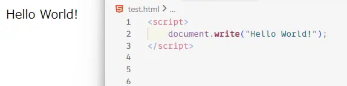

<h1>docs.mirrei.dev</h1>

   

[@mirrei-y](https://github.com/mirrei-y) が管理しているドキュメントリポジトリ

---

主に「組み込みシステム開発マイスター」JavaScript コースの講義資料を置いています。

## コンテンツ

- [Node.js を Windows にインストールする](https://docs.mirrei.dev/manual/installing/node/windows)
- [組み込みシステム開発マイスター JavaScriptコース講義資料 (2024 年度)](https://docs.mirrei.dev/meister/js/2024)
- [組み込みシステム開発マイスター JavaScriptコース講義資料 (2025 年度)](https://docs.mirrei.dev/meister/js/2025)
- [組み込みシステム開発マイスター JavaScriptコース講義資料 (2026 年度)](https://docs.mirrei.dev/meister/js/2026)

## ライセンス

- プログラム: MIT License
- ドキュメント (.mdx): CC BY 4.0
- 画像: CC0 1.0
    - ただし、以下の画像はそれぞれの著作権者の著作物です:
    - nodejs-unofficial-logo.webp
        - https://github.com/SAWARATSUKI/KawaiiLogos
    - http-abstract.webp
        - https://atmarkit.itmedia.co.jp/ait/articles/1703/29/news045.html
    - http-request.webp
        - https://atmarkit.itmedia.co.jp/ait/articles/1508/31/news016_3.html
    - web-api.webp
        - https://codezine.jp/article/detail/7169
    - forecast-api-response.webp
        - https://weather.tsukumijima.net/
    - google-maps.webp, google-maps-traffic.webp, google-maps-loading.webp
        - https://www.google.com/maps
